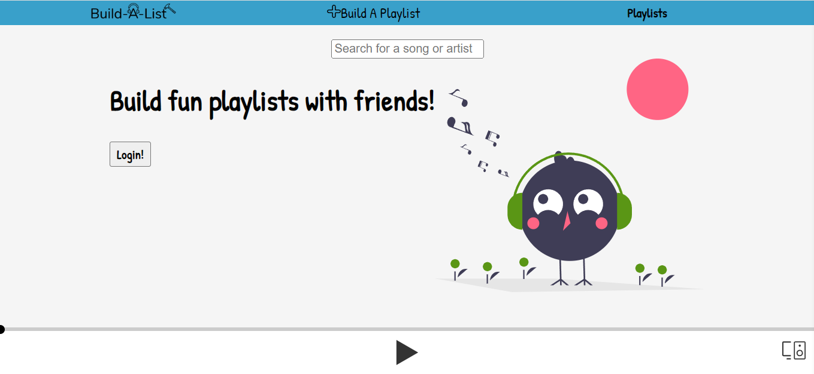
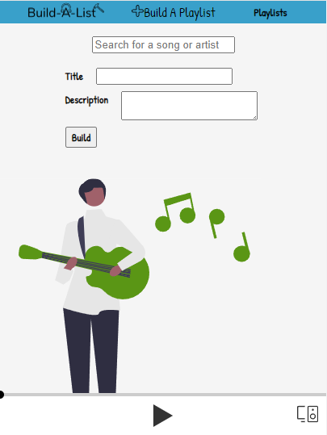
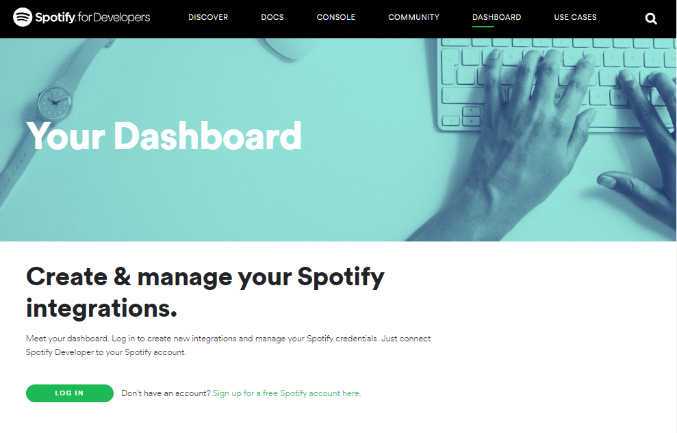
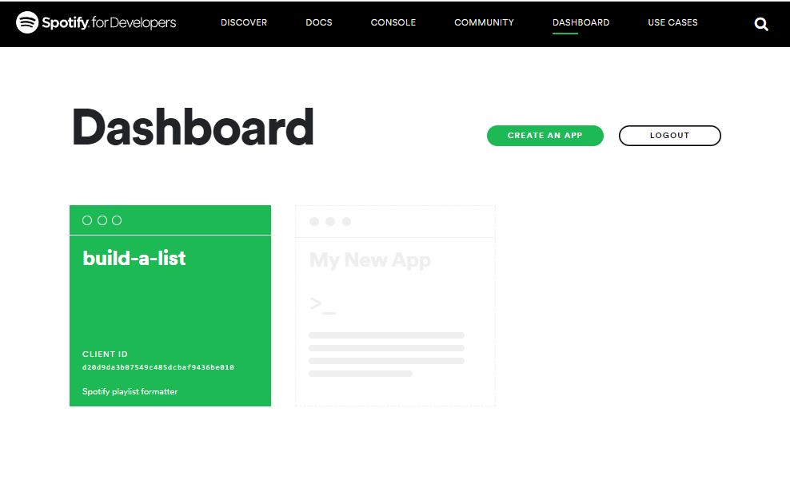
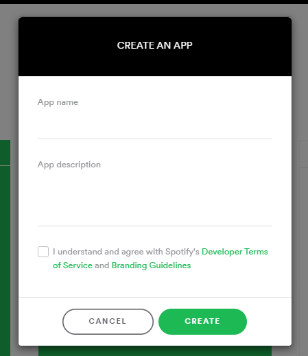
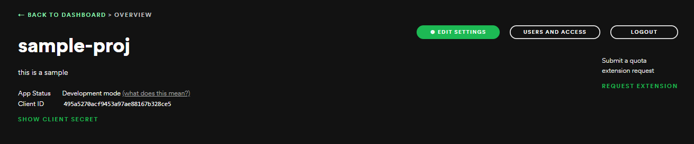
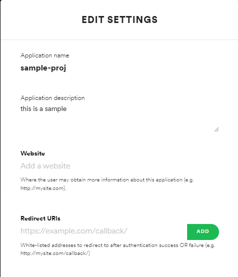

<div align="center">

  
  <h1>Build-A-List</h1>
  
  <p>
    A Spotify Playlist Builder 
  </p>

<br />

<!-- Table of Contents -->
# :notebook_with_decorative_cover: Table of Contents

- [About the Project](#star2-about-the-project)
  * [Screenshots](#camera-screenshots)
  * [Tech Stack](#space_invader-tech-stack)
  * [Environment Variables](#key-environment-variables)
- [Getting Started](#toolbox-getting-started)
  * [Prerequisites](#bangbang-prerequisites)
  * [Run Locally](#running-run-locally)
- [Usage](#eyes-usage)
- [Contact](#handshake-contact)
- [Acknowledgements](#gem-acknowledgements)

<!-- About the Project -->
## :star2: About the Project
<div align="center">
    <p>
        This project is a Spotify Playlist Builder that dynamically connects to the Spotify API, to not only get user data, but also manipulate it.
    </p>
</div>

<!-- Screenshots -->
### :camera: Screenshots
<div align="center"> 
  
  <p>This is the home page of the site, if you don't see the player at the bottom, you need to login</p>
  
  <p>This is the page where you build playlists</p>

</div>


<!-- TechStack -->
### :space_invader: Tech Stack
<details>
  <summary>Client</summary>
  <ul>
    <li><a href="https://greensock.com/">GreenSock</a></li>
    <li><a href="https://reactjs.org/">React.js</a></li>
    <li><a href="https://sass-lang.com/">Sass</a></li>
  </ul>
</details>

<details>
  <summary>Server</summary>
  <ul>
    <li><a href="https://www.nodejs.org/">Node</a></li>
    <li><a href="https://expressjs.com/">Express.js</a></li>
  </ul>
</details>

<!-- Env Variables -->
### :key: Environment Variables

To run this project, you will need to add the following environment variables to your .env file

`CLIENT_ID`

`CLIENT_SECRET`

`REDIRECT_URI`

<!-- Getting Started -->
## 	:toolbox: Getting Started
To get started, you will need a Spotify Premium account.

### :running: Run Locally

Clone the project

```bash
  git clone https://github.com/gabe305/build-a-list-client.git

  and

  git clone https://github.com/gabe305/build-a-list-server.git
```

Go to the spotify developer website, then navigate to the dashboard to login.



You will then be taken to the dashboard once logged, you should then "create an app".



For the purposes of trying this app, the app name and description don't need to be anything specific, however you must check the box to progress.



After creating an app you will be taken to this page, where you will then click the button "Edit Settings".



While in this menu, you must change Redirect URIs to include your local host server, mine was http://localhost:3000, after doing so, save and exit which will be at the bottom of this modal.



Now that you've gotten all the spotify work done you simply need to transfer the redirect uri, client id, and client secret information to your env file on the react app. 

You will also need to change the auth_url variable in the react app, in the home page file to include your redirect url, and client id.

Install dependencies

```bash 
  npm install
```

Start the server

```bash
  npm start
```

<!-- Usage -->
## :eyes: Usage

This project can be used to build and format Spotify playlists in an easier way, to allow for ease of access. In the future you will also be able to friend people and share playlists.

<!-- Contact -->
## :handshake: Contact

Gabriel Cruz - [LinkedIn](https://www.linkedin.com/in/gabriel-cruz-49129b222/) - gabecruz718@gmail.com

<!-- Acknowledgments -->
## :gem: Acknowledgements

Use this section to mention useful resources and libraries that you have used in your projects.

 - [Spotify-Web-Api-Node](https://www.npmjs.com/package/spotify-web-api-node)
 - [React-Spotify-Web-Playback](https://www.npmjs.com/package/react-spotify-web-playback)

